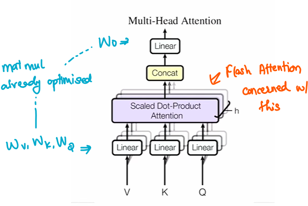
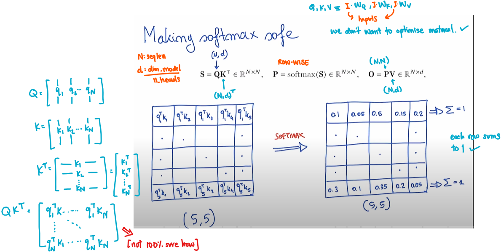
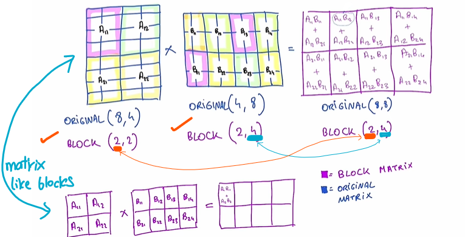
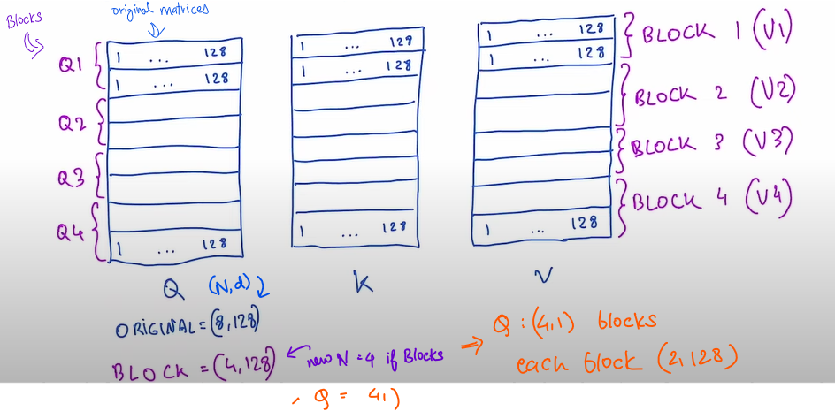
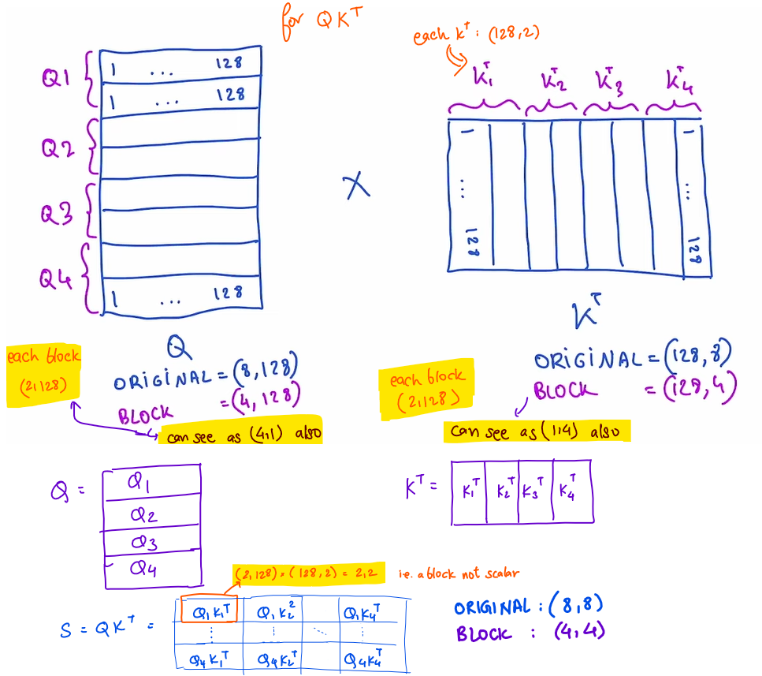
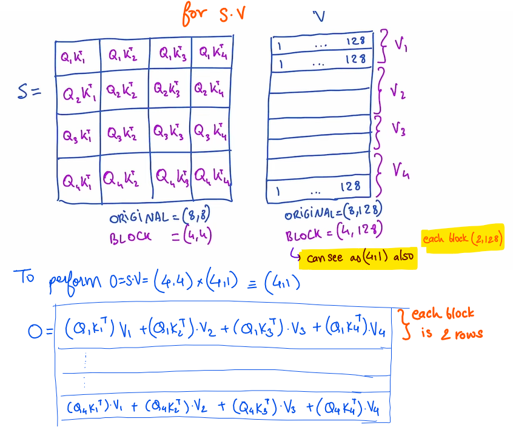
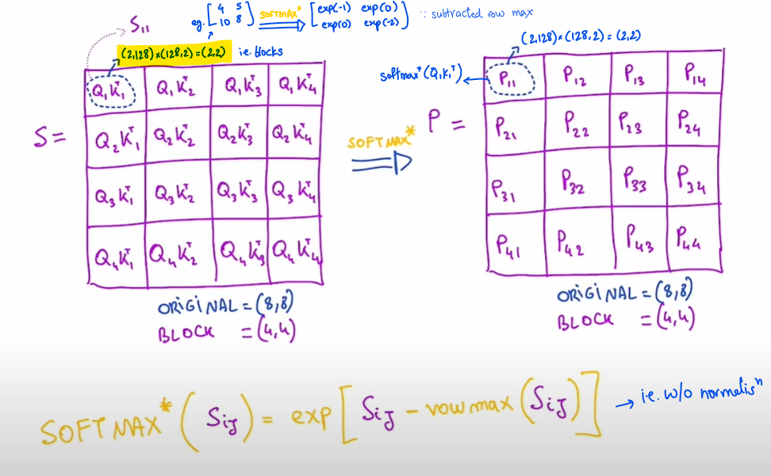
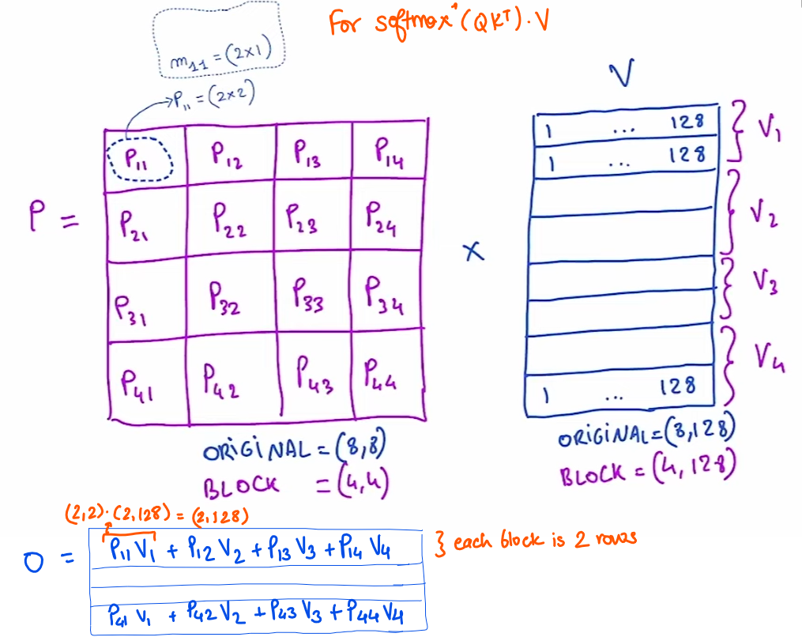

# Coding Flash Attention from Scratch!
> Like the previous few repos, all the content here is inspired from [@hkproj](https://github.com/hkproj) Umar Jamil. Here is the [YouTube video](https://www.youtube.com/watch?v=zy8ChVd_oTM). *What a Legend!*





## **MAKING SOFTMAX SAFE**

> **Numerically unstable** means it cannot be represented with a float32 or float16

### Intuition


<br>

$softmax(x_i) = \dfrac{\exp(x_i)}{\sum_1^N \exp(x_j)}$ . If values of vector are large, $\exp$ will explode. Therefore softmax is unsafe. This is how we make it safer 

```math
\begin{align*}
\frac{e^{x_i}}{\sum_{j=1}^N e^{x_j}} = \frac{c \cdot e^{x_i}}{\sum_{j=1}^N c \cdot e^{x_j}} 
&= \frac{e^{\log(c)} \cdot e^{x_i}}{\sum_{j=1}^N e^{\log(c)} \cdot e^{x_j}} 
&= \frac{e^{\log(c) + x_i}}{\sum_{j=1}^N e^{\log(c) + x_j}}
&= \frac{e^{x_i- k}}{\sum_{j=1}^N e^{x_j - k}}
\end{align*}
```
where $k = -\log{(c)}$ \
So we can *sneak in* a constant in the exponential to decrease its argument and make it safe. \
We will choose $k = \max_i{(x_i)}$ \ 
All exponentials become 0 or lesser, which can be represented well

### Algorithm
$$
softmax(x_i) = \dfrac{\exp(x_i - x_{max})}{\sum_1^N \exp(x_j - x_{max})}
$$ 

Given a `N*N` matrix,  for each row -
| Step  | Description                          | Time Complexity | Memory Reads |
|-------------|--------------------------------------|-----------------|--------------|
| 1           | Find the max value among all elements | O(N)            | O(N)         |
| 2           | Calculate the normalization factor   | O(N)            | O(N)         |
| 3           | Apply softmax to each element of the vector   | O(N)            | O(N)         |


### Pseudocode

1. Initialize $m_0 = -\infty$
2. **For** $i = 1$ to $N$:
   - $m_i = \max(m_{i-1}, x_i)$ $\rightarrow$ *Compute the max value*
   - $m_N$ becomes the maximum
3. Initialize $l_0 = 0$
4. **For** $j = 1$ to $N$:
   - $l_j = l_{j-1} + e^{x_j - m_N}$ $\rightarrow$  *Get the denominator*
   - $l_N$ becomes $e^{x_1 - m_N} + e^{x_2 - m_N} + \cdots + e^{x_N - m_N}$ 
5. **For** $k = 1$ to $N$:
   - $x_k \leftarrow \dfrac{e^{x_k - m_N}}{l_N}$ $\rightarrow$  *Apply softmax*

> Notice how each step depends on the previous step

**Hence, we need to make three passes over all elements of the row. Is there a better way?** <br>
Yes, using local maximums!

### Example to make it better
Consider an array `[3,2,5,1]`. To calculate `l` we would go like 
- $m_0 = 0, l_0 = 0$
- $m_1 = 3, l_1 = 0 + e^{3-3} $
- $m_2 = \max(3, 2) = 3, l_2 = l_1 + e^{2-3}$ $\rightarrow$  *If the array was only till here then it was okay*
- $m_3 = \max(3, 5) = 5, l_3 = l_2 + e^{5-5} = e^{3-3} + e^{2-3} + e^{5-5}$ $\rightarrow$  *Gone wrong* $\rightarrow$  *we wanted* $e^{3-5} + e^{2-5} + e^{5-5}$ 

To make a correction, we can use a correction factor $e^{3-5}$ i.e. $e^{prev~max - current~max}$
```math
\begin{align*}
    l_3 &= l_2 * e^{3-5} + e^{5-5}  \\
    &= l_2 * e^{3-5} + e^{5-5} \\
    &= (e^{3-3} + e^{2-3}) * e^{3-5} + e^{5-5} \\
    &= (e^{3-5} + e^{2-5}) + e^{5-5}
\end{align*}
```

- $m_4 = \max(5, 1) = 5, l_4 = l_3 * e^{5-5} + e^{1-5}$ $\rightarrow$ this is good

### Better pseudocode
Fuse the first two for-loops into one

1. Initialize $m_0 = -\infty$, $l_0 = 0$
2. **For** $i = 1$ to $N$:
   - $m_i = \max(m_{i-1}, x_i)$ $\rightarrow$ *Compute the local max value*
   - $l_i = l_{i-1} \cdot e^{m_{i-1} - m_i} + e^{x_i - m_i}$ 
   - $m_N$ becomes the maximum
   - $l_N$ becomes $\sum_{j=1}^N e^{x_j - x_{max}} $ 
3. **For** $k = 1$ to $N$:
   - $x_k \leftarrow \dfrac{e^{x_k - m_N}}{l_N}$ $\rightarrow$  *Apply softmax*

 
### Proof by Induction
1. Prove it works for $n=1$ <br>
    - $m_1 = \max(-\infty, x_1) = x_1 = \max_i{x_i} = x_{max}$ <br>
    - $l_1 = 0 * e^{-\infty} + e^{x_1-x_1} = \sum_{j=1}^N e^{x_i - x_{max}}$
2. Assume it holds for vector of size $N$, show it holds for vector of size $N+1$
    - $m_{N+1} = \max(m_N, x_{N+1}) = \max_i{x_i} = x_{max}$ <br>
```math
\begin{align*}
    l_{N+1} &= l_N * e^{m_N- m_{N+1}} + e^{x_{N+1}-m_{N+1}}  \\
    &= (\sum_{j=1}^{N} e^{x_j - m_N}) * e^{m_N- m_{N+1}} + e^{x_{N+1}-m_{N+1}} \\
    &= \sum_{j=1}^{N} e^{x_j - m_{N+1}} + e^{x_{N+1}-m_{N+1}} \\ 
    &= \sum_{j=1}^{N+1} e^{x_j - m_{N+1}} 
\end{align*}
```

> Question: check how is value of $l_N$ substituted directly

## **BLOCK MATRIX MULTIPLIATION**
Consider $A_{M, k} * B_{k, N} = C_{M,N}$. To make it fully parallel, we need as many cores as number of elements in the $C$ i.e. $M*N$. But we don't have that many cores/gpus. 



Consider the big matrices as collections of blocks. Output after multiplying blocks will be a block, instead of a scalar. 

$A_{1,1} \sim (4,2), A_{1,2} \sim (4,2)$ <br> 
$B_{1,1} \sim (2,2), B_{2,1} \sim (2,2)$ <br>
$A_{1,1} * B_{1,1} + A_{1,2} * B_{2,1} \sim (4,2) + (4,2) \sim (4,2)$

If we have say 8 cores, we can assign each block operation to a different core, all in parallel.  

## Application of BMM
We want to calculate 

$S = Q K^T \in ℝ^{N, N}$,  then $P = softmax(S)$, then $O = S V \in ℝ^{N, d}$

Let us not consider the softmax function for a while, then we do

$O = (Q K^T) V \in ℝ^{N, d}$ \
where $Q, K, V \in ℝ^{N, d}$








**Pseudocode** \
For each Block $Q_i$ \
&emsp; $O_i = Zeroes(2,128)$ \
&emsp; For each Block $K_j$  // Loop computes a row \
&emsp;&emsp; $O_i \leftarrow O_i + (Q_i K_j^T) V_J$  \
&emsp; End For \
End For


## Restoring Softmax




**Pseudocode** \
For each Block $Q_i$ \
&emsp; $O_i = Zeroes(2,128)$ \
&emsp; For each Block $K_j$  // Loop computes a row \
&emsp;&emsp; $P_{ij} = softmax^{*}(Q_i K_J^T)$ \
&emsp;&emsp; $O_i \leftarrow O_i + (Q_i K_j^T) V_J$  \
&emsp; End For \
End For

> **WRONG**: Each of the $P_{ij}$ block has been independently calculated such that the max element for each row in a block is the local max for each block and not the global max for each row.

> **Idea**: If we can *fix* the softmax while iterating on a row, we can also fix blocks of rows since the softmax is applied independently to each row.


## **ONLINE SOFTMAX**

