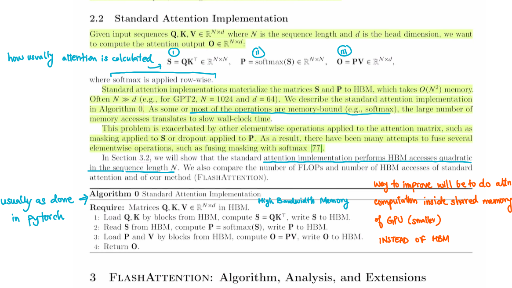

# Coding Flash Attention from Scratch!
> Like the previous few repos, all the content here is inspired from [@hkproj](https://github.com/hkproj) Umar Jamil. Here is the [YouTube video](https://www.youtube.com/watch?v=zy8ChVd_oTM). *What a Legend!*





## **MAKING SOFTMAX SAFE**

> **Numerically unstable** means it cannot be represented with a float32 or float16

### Intuition


<br>

$softmax(x_i) = \dfrac{\exp(x_i)}{\sum_1^N \exp(x_j)}$ . If values of vector are large, $\exp$ will explode. Therefore softmax is unsafe. This is how we make it safer 

```math
\begin{align*}
\frac{e^{x_i}}{\sum_{j=1}^N e^{x_j}} = \frac{c \cdot e^{x_i}}{\sum_{j=1}^N c \cdot e^{x_j}} 
&= \frac{e^{\log(c)} \cdot e^{x_i}}{\sum_{j=1}^N e^{\log(c)} \cdot e^{x_j}} 
&= \frac{e^{\log(c) + x_i}}{\sum_{j=1}^N e^{\log(c) + x_j}}
&= \frac{e^{x_i- k}}{\sum_{j=1}^N e^{x_j - k}}
\end{align*}
```
where $k = -\log{(c)}$ \
So we can *sneak in* a constant in the exponential to decrease its argument and make it safe. \
We will choose $k = \max_i{(x_i)}$ <br> 
All exponentials become 0 or lesser, which can be represented well

### Algorithm
$$
softmax(x_i) = \dfrac{\exp(x_i - x_{max})}{\sum_1^N \exp(x_j - x_{max})}
$$ 

Given a `N*N` matrix,  for each row -
| Step  | Description                          | Time Complexity | Memory Reads |
|-------------|--------------------------------------|-----------------|--------------|
| 1           | Find the max value among all elements | O(N)            | O(N)         |
| 2           | Calculate the normalization factor   | O(N)            | O(N)         |
| 3           | Apply softmax to each element of the vector   | O(N)            | O(N)         |


### Pseudocode

1. Initialize $m_0 = -\infty$
2. **For** $i = 1$ to $N$:
   - $m_i = \max(m_{i-1}, x_i)$ $\rightarrow$ *Compute the max value*
   - $m_N$ becomes the maximum
3. Initialize $l_0 = 0$
4. **For** $j = 1$ to $N$:
   - $l_j = l_{j-1} + e^{x_j - m_N}$ $\rightarrow$  *Get the denominator*
   - $l_N$ becomes $e^{x_1 - m_N} + e^{x_2 - m_N} + \cdots + e^{x_N - m_N}$ 
5. **For** $k = 1$ to $N$:
   - $x_k \leftarrow \dfrac{e^{x_k - m_N}}{l_N}$ $\rightarrow$  *Apply softmax*

> Notice how each step depends on the previous step

**Hence, we need to make three passes over all elements of the row. Is there a better way?** <br>
Yes, using local maximums!

### Example to make it better
Consider an array `[3,2,5,1]`. To calculate $l$ we would go like 
- $m_0 = 0, l_0 = 0$
- $m_1 = 3, l_1 = 0 + e^{3-3} $
- $m_2 = \max(3, 2) = 3, l_2 = l_1 + e^{2-3}$ $\rightarrow$  *If the array was only till here then it was okay*
- $m_3 = \max(3, 5) = 5, l_3 = l_2 + e^{5-5} = e^{3-3} + e^{2-3} + e^{5-5}$ $\rightarrow$  *Gone wrong* $\rightarrow$  *we wanted* $e^{3-5} + e^{2-5} + e^{5-5}$ 

To make a correction, we can use a correction factor $e^{3-5}$ i.e. $e^{prev~max - current~max}$
```math
\begin{align*}
    l_3 &= l_2 * e^{3-5} + e^{5-5}  \\
    &= l_2 * e^{3-5} + e^{5-5} \\
    &= (e^{3-3} + e^{2-3}) * e^{3-5} + e^{5-5} \\
    &= (e^{3-5} + e^{2-5}) + e^{5-5}
\end{align*}
```

- $m_4 = \max(5, 1) = 5, l_4 = l_3 * e^{5-5} + e^{1-5}$ $\rightarrow$ this is good

### Better pseudocode
Fuse the first two for-loops into one

1. Initialize $m_0 = -\infty$, $l_0 = 0$
2. **For** $i = 1$ to $N$:
   - $m_i = \max(m_{i-1}, x_i)$ $\rightarrow$ *Compute the local max value*
   - $l_i = l_{i-1} \cdot e^{m_{i-1} - m_i} + e^{x_i - m_i}$ 
   - $m_N$ becomes the maximum
   - $l_N$ becomes $\sum_{j=1}^N e^{x_j - x_{max}} $ 
3. **For** $k = 1$ to $N$:
   - $x_k \leftarrow \dfrac{e^{x_k - m_N}}{l_N}$ $\rightarrow$  *Apply softmax*

 
### Proof by Induction
1. Prove it works for $n=1$ <br>
    - $m_1 = \max(-\infty, x_1) = x_1 = \max_i{x_i} = x_{max}$ <br>
    - $l_1 = 0 * e^{-\infty} + e^{x_1-x_1} = \sum_{j=1}^N e^{x_i - x_{max}}$
2. Assume it holds for vector of size $N$, show it holds for vector of size $N+1$
    - $m_{N+1} = \max(m_N, x_{N+1}) = \max_i{x_i} = x_{max}$ <br>
```math
\begin{align*}
    l_{N+1} &= l_N * e^{m_N- m_{N+1}} + e^{x_{N+1}-m_{N+1}}  \\
    &= (\sum_{j=1}^{N} e^{x_j - m_N}) * e^{m_N- m_{N+1}} + e^{x_{N+1}-m_{N+1}} \\
    &= \sum_{j=1}^{N} e^{x_j - m_{N+1}} + e^{x_{N+1}-m_{N+1}} \\ 
    &= \sum_{j=1}^{N+1} e^{x_j - m_{N+1}} 
\end{align*}
```

> Question: check how is value of $l_N$ substituted directly

## **BLOCK MATRIX MULTIPLIATION**
Consider $A_{M, k} * B_{k, N} = C_{M,N}$. To make it fully parallel, we need as many cores as number of elements in the $C$ i.e. $M*N$. But we don't have that many cores/gpus. 


Consider the big matrices as collections of blocks. Output after multiplying blocks will be a block, instead of a scalar. 

$A_{1,1} \sim (4,2), A_{1,2} \sim (4,2)$ <br> 
$B_{1,1} \sim (2,2), B_{2,1} \sim (2,2)$ <br>
$A_{1,1} * B_{1,1} + A_{1,2} * B_{2,1} \sim (4,2) + (4,2) \sim (4,2)$

If we have say 8 cores, we can assign each block operation to a different core, all in parallel.  

## Application of BMM
We want to calculate 

$S = Q K^T \in ℝ^{N, N}$,  then $P = softmax(S)$, then $O = S V \in ℝ^{N, d}$

Let us not consider the softmax function for a while, then we do

$O = (Q K^T) V \in ℝ^{N, d}$ \
where $Q, K, V \in ℝ^{N, d}$


**Pseudocode** \
For each Block $Q_i$ \
&emsp; $O_i = Zeroes(2,128)$ \
&emsp; For each Block $K_j$  // Loop computes a row \
&emsp;&emsp; $O_i \leftarrow O_i + (Q_i K_j^T) V_J$  \
&emsp; End For \
End For


## Restoring Softmax


**Pseudocode** \
For each Block $Q_i$ \
&emsp; $O_i = Zeroes(2,128)$ \
&emsp; For each Block $K_j$  // Loop computes a row \
&emsp;&emsp; $P_{ij} = softmax^{*}(Q_i K_J^T)$ \
&emsp;&emsp; $O_i \leftarrow O_i + (Q_i K_j^T) V_J$  \
&emsp; End For \
End For

> **WRONG**: Each of the $P_{ij}$ block has been independently calculated such that the max element for each row in a block is the local max for each block and not the global max for each row.

> **Idea**: If we can *fix* the softmax while iterating on a row, we can also fix blocks of rows since the softmax is applied independently to each row.


## **ONLINE SOFTMAX**

**Initialization**
```math
m_0 = \begin{bmatrix} 
-\infty \\ 
-\infty 
\end{bmatrix} 
```

```math
l_0 = \begin{bmatrix} 
0 \\ 
0
\end{bmatrix}
```

```math
O_0 = \begin{bmatrix} 
0 & 0 & \dots & 0 \\ 
0 & 0 & \dots & 0 
\end{bmatrix} 
``` 
*$O_0 : 2 \times 128$* matrix \
$l$ is the normalisation factor


**Step 1** \
*Note how normalisation of softmax is not done here. We do it later*
1. $m_1 = \max(\text{rowmax}(Q_1 K_1^T), m_0)$  // the local maximum
2. $S_1 = Q_1 K_1^T$  
3. $l_1 = \text{rowsum}\left[\exp(S_1 - m_1)\right] + l_0 \exp(m_0 - m_1)$   // initially $l_0 = 0$
4. $P_{11} = \exp(S_1 - m_1)$  // same as $softmax*$
5. $O_1 = \text{diag}(\exp(m_0 - m_1)) O_0 + P_{11} V_1$  


```math
\begin{align*}
   O_1 &= \begin{bmatrix} 
   exp(m_1-m_2)_1 & 0 \\ 
   0 & exp(m_1-m_2)_2 
   \end{bmatrix} 
   \times
   \begin{bmatrix} 
   O_{11} & O_{12} & \dots & O_{1, 128} \\ 
   O_{21} & O_{22} & \dots & O_{2, 128} 
   \end{bmatrix} 
\end{align*}
``` 

**Step 2** 
1. $m_2 = \max(\text{rowmax}(Q_1 K_2^T), m_1)$  // we may have found a better maximum
2. $S_2 = Q_1 K_2^T$  
3. $l_2 = \text{rowsum}\left[\exp(S_2 - m_2)\right] + l_1 \exp(m_1 - m_2)$  
4. $P_{12} = \exp(S_2 - m_2)$  // same as $softmax*$
5. $O_1 = \text{diag}(\exp(m_1 - m_2)) O_1 + P_{12} V_2$  


**And so on until the last step. Then we apply the $l$ normalisation factor**. The last $l$ i.e. $l_4$ will contain the final normalisation.

**Step 5**\
$O_5 = \left[\text{diag}(l_4)\right]^{-1} O_4$


```math
l_4 = \begin{bmatrix} 
l_4^{(1)} \\ 
l_4^{(2)} 
\end{bmatrix} 

\rightarrow

\text{diag}(l_4)^{-1} = \begin{bmatrix} 
\dfrac{1}{l_4^{(1)}} & 0 \\ 
0 & \dfrac{1}{l_4^{(2)}}
\end{bmatrix} 
``` 

Multiplying them gives

```math
\text{diag}(l_4)^{-1}
\times 
\begin{bmatrix} 
[\dots & \dots & \dots ] \\ 
[\dots & \dots & \dots] 
\end{bmatrix} 
 = [2,2] \times [2,128]
 = [2, 128]
```

> Notice how this multiplication is like first row of $O_4$ is divided by $l_4^{(1)}$ and the second row by $l_4^{(2)}$


## **HOW DOES THE GPU WORK**


In the GPU, a group of threads share the same Control Unit. For GPU, it is much more efficient to add more workers instead of control units to each worker. Control units are expensive to add to the chip area of GPU.

> The DRAM is the main big memory of the GPU, also called High Bandwidth Memory (HBM). The GPU also has *streaming multiprocessors* that has a memory called **shared memory**, which is much much smaller thant he DRAM. Access to the DRAM is very slow and to the shared memory is very very fast. 

> When we work with CUDA, loading data is directly from the Global Memory (slow). Flash Attention reuses elements in the shared memory to reduce memory accesses. Then finally in storing phase, info is moved from the shared memory to the Global Memory. 

**Vector Addition** \
Top row has thread index \


**Vector Addition with blocks**\
We make blocks of size 32. Say GPU has 32 cores then each GPU core can work on one block at a time. 
If we have block of size 32 but GPU has 64 cores then GPU can schedule two blocks at a time. GPU decides how many blocks to schedule. 

> When we launch a CUDA kernel, CUDA will assign IDs to the blocks and the threads in each block. Then it is upto our understanding about how to map the block id and thread id with the data element.

N = Number of elements in vector.  We divide the vector into groups of 2 elements at a time for given 4 cores\


Given the Block id (`B_ID`) and thread id (`T_0`, `T_1`), how can we find which element does it correspond to.\
element_id (`i`) = `B_ID` * Block_size + `T_id`
```c
int i = blockIdx.x * blockDim.x + threadIdx.x;
```

> Working block by block allows the GPU to choose (schedule) how it wants to parallelise the operations


Another example \


```c
// grid = how many blocks we have
// block = N/block_size = how many threads we have for each block
cuda_vector_add<<<grid, block>>>(d_OUT, d_A, d_B, N);
```

**Matrix addition with blocks**

We have divided matrix into 3 blocks for rows and 3 blocks for columns i.e. 9 blocks. Remember that within each block along one dimension, we have divided it into 2 threads.\


```c
// indexing an array in c
// A[row_index][col_index]
size_t index = static_cast<size_t>(row_index) * NUM_COLS + col_index;  
```

> **BOTTOM LINE**: We decide how to divide the work i.e. we tell CUDA how many blocks we want and how many threads we want in each block. Based on the identifier of the block id and the thread id, WE come up with a way to map it to a sub-unit of work (eg. which part of the matrix or vector should the blocks and threads work with).


## **TENSOR LAYOUTS**

**Array/Vector (1D)** \


In C/CUDA, we get a **pointer** to the location in memory where the pointer **starts** and we use it to access all the rest of the elements


> Stride is useful because it allows us to reshape tensors easily without actually moving them around in memory. Moving around the memory is expensive. Simply changing the stride is *free!* 

**Matrix (2D) - Reshaping** \


**Matrix (2D) - Transpose** \


> NOTE: After transposing, the stride property is lost and the tensor is no longer *contiguous*. That is why in Pytorch you cannot `view` but you have to `reshape`.

**Matrix (3D) - Transpose** \


Stride = *product of dimensions after itself*


## **TRITON**
Refer to `/triton/vector_add.ipynb`

The launch grid tells triton how many blocks we want to launch. Earlier for CUDA kernels, we specified how many blocks and how many threads in each blocks i.e. we write at the thread level. In triton, we only tell about blocks, triton chooses how many threads to launch. We just tell what a group of threads should do.

Note that each program in triton works with a group of data i.e. not a single element but a block of elements.


## **FLASH ATTENTION FORWARD PASS**
Flash Attention version 1 had the outer for loop for each $K_j$ block and inner loop for $Q_i$ block $\rightarrow$ less parallelisable because we saw output of attention can be computed independently for each block of Queries (so easy to parallelise).

Infact we spawn many kernels each working with one iteration of the outer for loop of Query block. Each kernel will then iterate over the inner for loop of Key blocks.


At the end of for loops, we have to store output to the HBM


> Note: The algorithm above shows for only one sequence of length $N$, but we have to work with a batch of input sequences. We also will have multiple heads for each sequence which can work independently.

We will therefore parallelise - 
1. Each sequence in the batch
2. Each head (within the sequence)
3. Each Query block (within the head)

Max number of *programs* in parallel = $batch\_{size} * num\_{heads} * (seq\_{len} / block\_{size}\_{query}) $

> Triton implementation of attention does $2^x$ instead of $e^x$ maybe becuase it is faster. They compensate later by taking $log$ but we directly take $e^x$.

Usually in forward pass we'll store two things - row max and normalisation factor. But with **logsumexp** trick, we can only store one value $L_i$ (line 13 of algorithm)

> Every implementation in `torch` like softmax, relu etc is always implemented as a class which derives from `torch.autograd.function`. It should provide two methods - forward (pass) and backward (pass)


### **Splitting of the for loop**
*Causal Attention*: Do not allow Query to attend to Keys, Values after it. *Non-causal Attenion*: All Queries can attend to all Keys and Values.


## **LOGSUMEXP TRICK**


## **DERIVATIVES AND JACOBIANS**
### **Derivative**
Consider function with scalar input, scalar output i.e. $f : ℝ \rightarrow ℝ$

$y = f'(x) = \lim_{h \to 0} \dfrac{f(x + h) - f(x)}{h} = \dfrac{\textrm{how much output changes}}{\textrm{how much input changes}}$


```math
\begin{align*}
f(x + h) &\cong  f'(x) h + f(x) \\
f(x + \Delta x) &\cong f'(x) \Delta x + f(x) \\
f(x + \Delta x) &\cong \frac{\partial y}{\partial x} \Delta x + f(x) \\
y^{NEW} &\cong \frac{\partial y}{\partial x} \Delta x + y^{OLD} \\
\end{align*}
```
So when $X^{NEW} \rightarrow X^{OLD} + \Delta x$, it implies that $y^{NEW} \rightarrow y^{OLD} + \dfrac{\partial y}{\partial x} \Delta x$ 

In other words, if $X$ is changed by $\Delta x$, then $y$ wil change approxmately by $\dfrac{\partial y}{\partial x} \Delta x$


### **Chain Rule**
Let $z = f(g(x))$

We have:
$x \xrightarrow{g} y \xrightarrow{f} z$

Step-by-step changes:

$x^{NEW} \to x^{OLD} + \Delta x \implies y^{NEW} \cong y^{OLD} + \dfrac{\partial y}{\partial x} \Delta x$

$y^{NEW} \to y^{OLD} + \Delta y \implies z^{NEW} \cong z^{OLD} + \dfrac{\partial z}{\partial y} \Delta y$

Substituting:
$z^{NEW} \cong z^{OLD} + \dfrac{\partial z}{\partial y} \cdot \dfrac{\partial y}{\partial x} \Delta x$

$$\dfrac{\partial z}{\partial x} = \dfrac{\partial z}{\partial y} \cdot \dfrac{\partial y}{\partial x}$$


### **Gradient**
Consider function with Vector input, scalar output i.e. $f : ℝ^{N} \rightarrow ℝ$ 

> The gradient takes a scalar function as input and produces a vector field as output. The dot product between the gradient and a direction vector produces a scalar (the directional derivative). The gradient's purpose is to pack together all the partial derivative information of a function into a vector.

```math
f \left( \begin{bmatrix} 
x_1 \\ 
x_2 
\end{bmatrix} \right)
 = y
```

> Note that $\Delta x$ is a vector now i.e. $(\partial x_1, \partial x_2, \dots \partial x_n)$

${\text{When}}~x^{NEW} \rightarrow x^{OLD} + \Delta x \dots {\text{(vector sum)}}$ <br>
${\text{Implies}}~ y^{NEW} \rightarrow y^{OLD} + \dfrac{\partial y}{\partial x} \Delta x \dots {\text{(dot product of gradient and direction vector )}}$ <br>

$\dfrac{\partial y}{\partial x} \Delta x = \dfrac{\partial y}{\partial x_1} \Delta x_1 + \dfrac{\partial y}{\partial x_2} \Delta x_2 + \dots + \dfrac{\partial y}{\partial x_N} \Delta x_N$

```math
\text{Gradient} = \dfrac{\partial y}{\partial x} 
```
i.e. the gradient is a vector made up of all partial derivatives


### **Jacobian**
Consider function with Vector input, vector output i.e. $f : ℝ^{N} \rightarrow ℝ^{M}$

```math
f \left( \begin{bmatrix} 
x_1 \\ 
x_2 
\end{bmatrix} \right)
 = \begin{bmatrix} 
y_1 \\ 
y_2 \\
y_3
\end{bmatrix}
```

${\text{When}}~x^{NEW} \rightarrow x^{OLD} + \Delta x \dots {\text{(vector sum)}}$ <br>
${\text{Implies}}~ y^{NEW} \rightarrow y^{OLD} + \dfrac{\partial y}{\partial x} \Delta x \dots {\text{(Matrix-vector product of Jacobian and direction vector)}}$ <br>

```math
\text{Jacobian} = 
\begin{bmatrix}
\dfrac{\partial y_1}{\partial x_1} & \dfrac{\partial y_1}{\partial x_2} & \cdots & \dfrac{\partial y_1}{\partial x_N} \\
\vdots & \vdots & \ddots & \vdots \\
\dfrac{\partial y_M}{\partial x_1} & \dfrac{\partial y_M}{\partial x_2} & \cdots & \dfrac{\partial y_M}{\partial x_N}
\end{bmatrix}
```

$\dfrac{\partial y}{\partial x} \Delta x \rightarrow (M \times N) \times (N \times 1) = (M \times 1)$


### **Generalised Jacobian**
Consider function with Tensor input, tensor output i.e. $f : ℝ^{N_1 \times \dots \times N_{D_X}} \rightarrow ℝ^{M_1 \times \dots \times M_{D_Y}}$

$f(D_X \text{ - dimensional tensor}) = D_Y\text{ - dimensional tensor}$


${\text{When}}~x^{NEW} \rightarrow x^{OLD} + \Delta x \dots {\text{(tensor sum)}}$ <br>
${\text{Implies}}~ y^{NEW} \rightarrow y^{OLD} + \dfrac{\partial y}{\partial x} \Delta x \dots {\text{(Tensor product)}}$ <br>

```math
\text{Generalised Jacobian} = \dfrac{\partial y}{\partial x} 
```

$\dfrac{\partial y}{\partial x} \Delta x \rightarrow (M_1 \times \dots \times M_{D_Y}) \times (N_1 \times \dots \times N_{D_X})$


## **AUTOGRAD WITH DERIVATIVES**


$y_3$ becomes our loss function (scalar). We need gradient of loss function with respect to all inputs (leafs i.e. parameters $w_1, b_1$ and inputs $a$) of the computational graph. 

$\phi = y_3 = (y_2)^2 = (y_1 + b_1)^2 = (a w_1 + b_1 )^2$

*Method 1 :* If we directly know loss function wrt inputs (as in this case), then we can directly compute the gradients

$\dfrac{\partial \phi}{\partial w_1} = 2(a w_1 + b_1 ) (a) = 2 a (a w_1 + b_1)$

*Method 2 :* Using chain rule, 

```math
\begin{align*}
\dfrac{\partial \phi}{\partial w_1} &= \dfrac{\partial \phi}{\partial y_3} \cdot \dfrac{\partial y_3}{\partial y_2} \cdot \dfrac{\partial y_2}{\partial y_1} \cdot \dfrac{\partial y_1}{\partial w_1} \\
&= 1 \cdot 2 y_2 \cdot 1 \cdot a \\
&= 2a y_2 \\
&= 2a (a w_1 + b_1)
\end{align*}
```

> Pytorch does not know the symbolic operations that led to the output i.e. it does not know the exact expression each function is computes, it treats each function like a blackbox. It only knows what are the functions that computed the output. Each function in pytorch is a class which implements two methods - forward step and backward step.

**Forward step:** Takes input and returns output \
**Backward step:** Takes the gradient of the loss function wrt its output and needs to compute the gradient of the loss function wrt its input.

Pytorch cannot calculate gradient of the loss function wrt input because of not knowing the symbolic representation. 

*Step 1A:* Pytorch knows gradient of loss function wrt $y_3$ i.e. last function's output i.e. $\dfrac{\partial \phi}{\partial y_3}$ ( = 1 ;) \
*Step 1B:* It asks the function if it can give gradient of loss function wrt $y_2$ i.e. its input. **YES! Using Chain Rule.** The function can take this given gradient and multiply by the Jacobian (here gradient) of output wrt input. **This gives us the gradient of loss function wrt input.**

```math
\begin{align*}
\dfrac{\partial \phi}{\partial y_2} &= \dfrac{\partial \phi}{\partial y_3} \cdot \dfrac{\partial y_3}{\partial y_2} \\
\dfrac{\partial \text{(loss)}}{\partial \text{(input)}} &= \dfrac{\partial \text{(loss)}}{\partial \text{(output)}} \cdot \dfrac{\partial \text{(output)}}{\partial \text{(input)}} \\ 
&= \text{known} \cdot \text{Jacobian of output wrt input}
\end{align*}
```

*Step 2A:* Pytorch knows this $\dfrac{\partial \phi}{\partial y_2}$ \
*Step 2B:* Asks same question to the previous function. Again Chain Rule. $\dfrac{\partial \phi}{\partial y_1} = \dfrac{\partial \phi}{\partial y_2} \cdot \dfrac{\partial y_2}{\partial y_1}$


*Step 3A:* Pytorch knows this $\dfrac{\partial \phi}{\partial y_1}$ \
*Step 3B:* Again Chain Rule. $\dfrac{\partial \phi}{\partial w_1} = \dfrac{\partial \phi}{\partial y_1} \cdot \dfrac{\partial y_1}{\partial w_1}$

> Pytorch therefore runs one operator at a time, backwards in the computation graph, knocking the door of each operator. Each operator applies the Chain rule to calculate the gradient Pytorch needs.

### **Problem with Jacobian**
Consider matrices $Y^{N,M}, X^{N, D}, W^{D, M}$

> Look at $X$ as a collection of $N$ vectors each of $D$ dimensions. 

```math
\begin{align*}
Y &= X W \\
\dfrac{\partial \phi}{\partial X} &= \dfrac{\partial \phi}{\partial X} \cdot \dfrac{\partial Y}{\partial X} \\
\text{Downstream gradient} &= \text{Upstream gradient} \cdot \text{Local Jacobian}
\end{align*}
```

Here, the Jacobian matrix's size will be $(N, M) \times (N, D)$ i.e. $N \times M \times N \times D$. Considering N is say 1024, Jacobian matrix becomes huge. **However, the Jacobian matrix is super sparse**. We can optimise the problem without fully storing the Jacobian matrix. 


If we look at the effect of input tokens on output tokens, 

```math
\begin{bmatrix}
[\text{input row 1}]\\
[\text{input row 2}]\\
\vdots  \\
[\text{input row N}]\\
\end{bmatrix}_{N, D}

\times 

\begin{bmatrix}
[\cdots & \cdots  & \cdots ]\\
[\cdots & \cdots  & \cdots ]\\
\vdots & \vdots &  \vdots \\
[\cdots & \cdots  & \cdots ]\\
\end{bmatrix}_{D, M}

=

\begin{bmatrix}
[\text{output row 1}]\\
[\text{output row 2}]\\
\vdots  \\
[\text{output row N}]\\
\end{bmatrix}_{N, M}
```

Note how $\text{output row 1}$ is the dot product of $\text{input row 1}$ and all columns of the second $(D, M)$ matrix <br>

So, the derivatives of each of elements of $\text{output row 1}$ wrt dimensions of all tokens in the first $(N, D)$ matrix except for the $\text{input row 1}$ will be 0 

> In other words, derivatives of $\text{output row 1}$ wrt all of $\text{input row 1} \cdots \text{input row N}$ will be 0 

## **GRADIENT OF THE MATMUL OPERATATION**
Consider $Y = X W$. During the backward pass, Pytorch will give gradients of the loss i.e. $\dfrac{\partial \phi}{\partial Y}$, and require us to compute the gradients of the loss function wrt the inputs $X$ and $W$.

> Note that we cannot directly use the Jacobian and the chain rule here due to big size of Jacobian. We use the sparsity to our advantage.

> **IMPORTANT:** Also remember how the shape of the gradient is equal to the shape of the denominator (input). The numerator is a scalar and the denominator is a vector. 

The main class is a node in the computational graph, that takes input `Q, K, V` and outputs `O`
```python
class TritonAttention(torch.autograd.Function):
    @staticmethod
    def forward(ctx, Q, K, V, causal, softmax_scale):
```

Pytorch gives gradient of loss wrt `O` i.e. $\dfrac{\partial \phi}{\partial O}$, then will ask the class to compute the gradient of loss wrt `Q, K, V`. 

> We are fusing together operations like $Q K^T$, `softmax`, matmul, we need to derive by hand the gradient of the loss wrt input of matlmul, and give to Pytorch.

Continuing on $Y = X W$, we need $\dfrac{\partial \phi}{\partial X}$, $\dfrac{\partial \phi}{\partial W}$. <br>

Consider $X^{N, D}, W^{D, M}, Y^{N,M}$, (N=1, D=3, M=4) <br>

Again, Pytorch gives us $\dfrac{\partial \phi}{\partial Y}$ i.e. a tensor of shape $[N,M]$, we need $\dfrac{\partial \phi}{\partial X}$ i.e. tensor of shape $[N, D]$


```math
\begin{align*}

Y &= 
\begin{bmatrix}
X_{11} & X_{12} & X_{13}
\end{bmatrix}

\times 

\begin{bmatrix}
W_{11} & W_{12} & W_{13} & W_{14}\\
W_{21} & W_{22} & W_{23} & W_{24}\\
W_{31} & W_{32} & W_{33} & W_{34}\\
\end{bmatrix} \\

&= 

\begin{bmatrix}
(X_{11}W_{11} + X_{12}W_{21} + X_{13}W_{31}) & \dots & \dots & (X_{11}W_{14} + X_{12}W_{24} + X_{13}W_{34})
\end{bmatrix} \\


\end{align*}
```

Let $\dfrac{\partial \phi}{\partial Y} = \begin{bmatrix}dy_{11} & dy_{12} & dy_{13} & dy_{14}\end{bmatrix}$

```math
\dfrac{\partial \phi}{\partial X} = \dfrac{\partial \phi}{\partial Y} \cdot \dfrac{\partial Y}{\partial X} 
```

Try to solve RHS and see if anything simplifies. The Jacobian can be written as - 

```math
\begin{align*}

\dfrac{\partial Y}{\partial X} &= 
\begin{bmatrix}
W_{11} & W_{21} & W_{31} \\
W_{12} & W_{22} & W_{32} \\
W_{13} & W_{23} & W_{33} \\
W_{14} & W_{24} & W_{34} \\
\end{bmatrix} \\

&= W^T !!
\end{align*}
```

> NOTE: If we try the same with $N = 2$, we will see the Jacobian being sparse, but with a repeating pattern. The Jacobian worked out for $N=1$ is the repeating pattern in the Jacobian that can be applied to each vector in the tensor $\dfrac{ \partial \phi}{\partial Y}$

```math
\begin{align*}
\dfrac{\partial \phi}{\partial X} &= \dfrac{\partial \phi}{\partial Y} \cdot \dfrac{\partial Y}{\partial X} \\
&= \dfrac{\partial \phi}{\partial Y} \cdot W^T \\
&= [N, M] \cdot [M, D] \\
&= [N, D]\\
&= \text{Downstream gradient}
\end{align*}
```

Similarly we get, $\dfrac{\partial \phi}{\partial W} = X^T \cdot \dfrac{\partial \phi}{\partial Y} = [D,N] \cdot [N, M] = [D,M] $

> Can remember like this is the only way the shapes will work out :)


## **GRADIENT THROUGH THE SOFTMAX**

$S = Q K^T; P = \text{Softmax}(S); O = PV$


> Blackbox is wrt Pytorch!

Given $\dfrac{\partial \phi}{\partial O}$ (by Pytorch), we need to calculate $\dfrac{\partial \phi}{\partial Q}, \dfrac{\partial \phi}{\partial K}, \dfrac{\partial \phi}{\partial V}$

Note that there are many intermediate steps from $O$ to $Q, K, V$ like matmul, softmax, another matmul etc. Again, directly using the Chain rule is infeasible because of large size. We need to figure out a way without materialising the Jacobian

Softmax is applied row-wise. We start by looking at one row at a time. 
Let $S_i = \text{one row of S matrix} = S[i, :] \in ℝ^{N}$ 

$P_i = \text{Softmax}(S_i) \in \in ℝ^{N}$

$\text{Softmax}(P_{ij}) = \dfrac{\exp{S_{ij}}}{\sum_{l=1}^{N} \exp{S_{il}}}$

> NOTE: In the forward pass, we were subtracting the max from each row. However, remember that either subtracting or not, both operations are mathematically equivalent

We want $\dfrac{\partial \phi}{\partial S_i} = \dfrac{\partial \phi}{\partial P_i} \cdot \dfrac{\partial P_i}{\partial S_i}$

> Also in this case we analyse the Jacobian wrt a single input vector, which will be the repeating pattern that can be applied independently to each vector in $\dfrac{\partial \phi}{\partial P_i}$. If we compute the Jacobian using two input vectors, we will see it will be a sparse matrix.

### **What each element in the Jacobian will look like**

$\text{Jacobian} = \dfrac{\partial P_i}{\partial S_i}$

Each element $\dfrac{\partial P_{ij}}{\partial S_{ik}} = \dfrac{\dfrac{\exp{S_{ij}}}{\sum_{l=1}^{N} \exp{S_{il}}}}{\partial S_{ik}}$

> Note how if $P = \begin{bmatrix}P_{11} & P_{12} &  P_{13} \end{bmatrix}$ and $S = \begin{bmatrix}S_{11} & S_{12} & S_{13}\end{bmatrix}$, then $\dfrac{\partial P_{ij}}{\partial S_{ik}}$ will be partial of $P_{11}$ wrt $\begin{bmatrix}S_{11} & S_{12} & S_{13}\end{bmatrix}$, then of $P_{12}$ and $P_{13}$


Remember differential of fraction is given by 
```math
\left[\dfrac{f(x)}{g(x)}\right]' = \dfrac{f'(x)g(x) - g'(x)f(x)}{\left[g(x)\right]^2}
```

> NOTE: Here we are taking derivative wrt $S_{ik}$ instead of the usual $x$

Now for cases where $j = k$, 
```math
\begin{align*}
\dfrac{\partial P_{ij}}{\partial S_{ik}} &= \dfrac{e^{S_{ij}} \cdot \sum_{l=1}^{N} e^{S_{il}} - e^{S_{ik}} \cdot e^{S_{ij}}}{\left(\sum_{l=1}^{N} e^{S_{il}}\right)^2} \\
&= \dfrac{e^{S_{ij}}\left( \sum_{l=1}^{N} e^{S_{il}} - e^{S_{ik}} \right)}{\left(\sum_{l=1}^{N} e^{S_{il}}\right)^2} \\
&= \dfrac{e^{S_{ij}}}{\sum_{l=1}^{N} e^{S_{il}}} \cdot \dfrac{ \sum_{l=1}^{N} e^{S_{il}} - e^{S_{ik}}}{\sum_{l=1}^{N} e^{S_{il}}} \\
&= P_{ij} \cdot (1 - P_{ik})
\end{align*}
```

Now for cases where $j \neq k$, 
```math
\begin{align*}
\dfrac{\partial P_{ij}}{\partial S_{ik}} &= \dfrac{0 - e^{S_{ik}} \cdot e^{S_{ij}}}{\left(\sum_{l=1}^{N} e^{S_{il}}\right)^2} \\
&= \dfrac{ - e^{S_{ik}}}{\sum_{l=1}^{N} e^{S_{il}}} \cdot \dfrac{e^{S_{ij}}}{\sum_{l=1}^{N} e^{S_{il}}}  \\
&= - P_{ik} \cdot P_{ij}
\end{align*}
```

In summary, we have
```math
\dfrac{\partial P_{ij}}{\partial S_{ik}} =
\begin{cases}
   P_{ij}  (1 - P_{ik}) & \text{for }  j = k \\
   - P_{ik} P_{ij} & \text{for } j \neq k \\
\end{cases}
```

The Jacobian then becomes 
```math
\begin{align*}

\dfrac{\partial P_{ij}}{\partial S_{ik}} &= 
\begin{bmatrix}
P_{i1}(1-P_{i1}) & -P_{i1}P_{i2} & -P_{i1}P_{i3} & \dots & -P{i1}P_{iN} \\
-P_{i2}P_{i1} & P_{i2}(1-P_{i2}) & -P_{i2}P_{i3} & \dots & -P_{i2}P_{iN} \\
\vdots & \vdots & \vdots & \ddots & \vdots \\
-P_{iN}P_{i1} & -P_{iN}P_{i2} & -P_{iN}P_{i3} & \dots & P_{iN}(1-P_{iN}) \\
\end{bmatrix} \\

&= \text{diag}(P_i) - P_{i} P_{i}^T \\
&= \text{formula given in the paper} \\
\end{align*}
```

> Each diagonal term is like $P_{i1}(1-P_{i1}) = P_{i1} - P_{i1}P_{i1}$. Seperate this way into two matrices, and since $P_i$ is a column vector, $P_i P_i^T$ will be a matrix


FlashAttention paper writes that if $y = \text{Softmax}(x)$ then its $\text{Jacobian} = \text{diag(y)} - yy^T$

