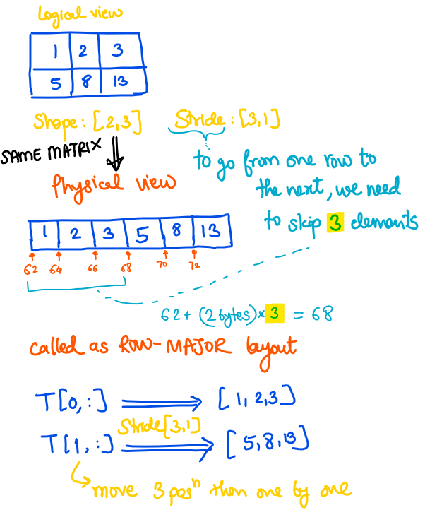

# Coding Flash Attention from Scratch!
> Like the previous few repos, all the content here is inspired from [@hkproj](https://github.com/hkproj) Umar Jamil. Here is the [YouTube video](https://www.youtube.com/watch?v=zy8ChVd_oTM). *What a Legend!*


## **MAKING SOFTMAX SAFE**

> **Numerically unstable** means it cannot be represented with a float32 or float16

### Intuition


<br>

$softmax(x_i) = \dfrac{\exp(x_i)}{\sum_1^N \exp(x_j)}$ . If values of vector are large, $\exp$ will explode. Therefore softmax is unsafe. This is how we make it safer 

```math
\begin{align*}
\frac{e^{x_i}}{\sum_{j=1}^N e^{x_j}} = \frac{c \cdot e^{x_i}}{\sum_{j=1}^N c \cdot e^{x_j}} 
&= \frac{e^{\log(c)} \cdot e^{x_i}}{\sum_{j=1}^N e^{\log(c)} \cdot e^{x_j}} 
&= \frac{e^{\log(c) + x_i}}{\sum_{j=1}^N e^{\log(c) + x_j}}
&= \frac{e^{x_i- k}}{\sum_{j=1}^N e^{x_j - k}}
\end{align*}
```
where $k = -\log{(c)}$ \
So we can *sneak in* a constant in the exponential to decrease its argument and make it safe. \
We will choose $k = \max_i{(x_i)}$ \ 
All exponentials become 0 or lesser, which can be represented well

### Algorithm
$$
softmax(x_i) = \dfrac{\exp(x_i - x_{max})}{\sum_1^N \exp(x_j - x_{max})}
$$ 

Given a `N*N` matrix,  for each row -
| Step  | Description                          | Time Complexity | Memory Reads |
|-------------|--------------------------------------|-----------------|--------------|
| 1           | Find the max value among all elements | O(N)            | O(N)         |
| 2           | Calculate the normalization factor   | O(N)            | O(N)         |
| 3           | Apply softmax to each element of the vector   | O(N)            | O(N)         |


### Pseudocode

1. Initialize $m_0 = -\infty$
2. **For** $i = 1$ to $N$:
   - $m_i = \max(m_{i-1}, x_i)$ $\rightarrow$ *Compute the max value*
   - $m_N$ becomes the maximum
3. Initialize $l_0 = 0$
4. **For** $j = 1$ to $N$:
   - $l_j = l_{j-1} + e^{x_j - m_N}$ $\rightarrow$  *Get the denominator*
   - $l_N$ becomes $e^{x_1 - m_N} + e^{x_2 - m_N} + \cdots + e^{x_N - m_N}$ 
5. **For** $k = 1$ to $N$:
   - $x_k \leftarrow \dfrac{e^{x_k - m_N}}{l_N}$ $\rightarrow$  *Apply softmax*

> Notice how each step depends on the previous step

**Hence, we need to make three passes over all elements of the row. Is there a better way?** <br>
Yes, using local maximums!

### Example to make it better
Consider an array `[3,2,5,1]`. To calculate `l` we would go like 
- $m_0 = 0, l_0 = 0$
- $m_1 = 3, l_1 = 0 + e^{3-3} $
- $m_2 = \max(3, 2) = 3, l_2 = l_1 + e^{2-3}$ $\rightarrow$  *If the array was only till here then it was okay*
- $m_3 = \max(3, 5) = 5, l_3 = l_2 + e^{5-5} = e^{3-3} + e^{2-3} + e^{5-5}$ $\rightarrow$  *Gone wrong* $\rightarrow$  *we wanted* $e^{3-5} + e^{2-5} + e^{5-5}$ 

To make a correction, we can use a correction factor $e^{3-5}$ i.e. $e^{prev~max - current~max}$
```math
\begin{align*}
    l_3 &= l_2 * e^{3-5} + e^{5-5}  \\
    &= l_2 * e^{3-5} + e^{5-5} \\
    &= (e^{3-3} + e^{2-3}) * e^{3-5} + e^{5-5} \\
    &= (e^{3-5} + e^{2-5}) + e^{5-5}
\end{align*}
```

- $m_4 = \max(5, 1) = 5, l_4 = l_3 * e^{5-5} + e^{1-5}$ $\rightarrow$ this is good

### Better pseudocode
Fuse the first two for-loops into one

1. Initialize $m_0 = -\infty$, $l_0 = 0$
2. **For** $i = 1$ to $N$:
   - $m_i = \max(m_{i-1}, x_i)$ $\rightarrow$ *Compute the local max value*
   - $l_i = l_{i-1} \cdot e^{m_{i-1} - m_i} + e^{x_i - m_i}$ 
   - $m_N$ becomes the maximum
   - $l_N$ becomes $\sum_{j=1}^N e^{x_j - x_{max}} $ 
3. **For** $k = 1$ to $N$:
   - $x_k \leftarrow \dfrac{e^{x_k - m_N}}{l_N}$ $\rightarrow$  *Apply softmax*

 
### Proof by Induction
1. Prove it works for $n=1$ <br>
    - $m_1 = \max(-\infty, x_1) = x_1 = \max_i{x_i} = x_{max}$ <br>
    - $l_1 = 0 * e^{-\infty} + e^{x_1-x_1} = \sum_{j=1}^N e^{x_i - x_{max}}$
2. Assume it holds for vector of size $N$, show it holds for vector of size $N+1$
    - $m_{N+1} = \max(m_N, x_{N+1}) = \max_i{x_i} = x_{max}$ <br>
```math
\begin{align*}
    l_{N+1} &= l_N * e^{m_N- m_{N+1}} + e^{x_{N+1}-m_{N+1}}  \\
    &= (\sum_{j=1}^{N} e^{x_j - m_N}) * e^{m_N- m_{N+1}} + e^{x_{N+1}-m_{N+1}} \\
    &= \sum_{j=1}^{N} e^{x_j - m_{N+1}} + e^{x_{N+1}-m_{N+1}} \\ 
    &= \sum_{j=1}^{N+1} e^{x_j - m_{N+1}} 
\end{align*}
```

> Question: check how is value of $l_N$ substituted directly

## **BLOCK MATRIX MULTIPLIATION**
Consider $A_{M, k} * B_{k, N} = C_{M,N}$. To make it fully parallel, we need as many cores as number of elements in the $C$ i.e. $M*N$. But we don't have that many cores/gpus. 


Consider the big matrices as collections of blocks. Output after multiplying blocks will be a block, instead of a scalar. 

$A_{1,1} \sim (4,2), A_{1,2} \sim (4,2)$ <br> 
$B_{1,1} \sim (2,2), B_{2,1} \sim (2,2)$ <br>
$A_{1,1} * B_{1,1} + A_{1,2} * B_{2,1} \sim (4,2) + (4,2) \sim (4,2)$

If we have say 8 cores, we can assign each block operation to a different core, all in parallel.  

## Application of BMM
We want to calculate 

$S = Q K^T \in ℝ^{N, N}$,  then $P = softmax(S)$, then $O = S V \in ℝ^{N, d}$

Let us not consider the softmax function for a while, then we do

$O = (Q K^T) V \in ℝ^{N, d}$ \
where $Q, K, V \in ℝ^{N, d}$


**Pseudocode** \
For each Block $Q_i$ \
&emsp; $O_i = Zeroes(2,128)$ \
&emsp; For each Block $K_j$  // Loop computes a row \
&emsp;&emsp; $O_i \leftarrow O_i + (Q_i K_j^T) V_J$  \
&emsp; End For \
End For


## Restoring Softmax


**Pseudocode** \
For each Block $Q_i$ \
&emsp; $O_i = Zeroes(2,128)$ \
&emsp; For each Block $K_j$  // Loop computes a row \
&emsp;&emsp; $P_{ij} = softmax^{*}(Q_i K_J^T)$ \
&emsp;&emsp; $O_i \leftarrow O_i + (Q_i K_j^T) V_J$  \
&emsp; End For \
End For

> **WRONG**: Each of the $P_{ij}$ block has been independently calculated such that the max element for each row in a block is the local max for each block and not the global max for each row.

> **Idea**: If we can *fix* the softmax while iterating on a row, we can also fix blocks of rows since the softmax is applied independently to each row.


## **ONLINE SOFTMAX**

**Initialization**
```math
m_0 = \begin{bmatrix} 
-\infty \\ 
-\infty 
\end{bmatrix} 
```

```math
l_0 = \begin{bmatrix} 
0 \\ 
0
\end{bmatrix}
```

```math
O_0 = \begin{bmatrix} 
0 & 0 & \dots & 0 \\ 
0 & 0 & \dots & 0 
\end{bmatrix} 
``` 
*$O_0 : 2 \times 128$* matrix \
$l$ is the normalisation factor


**Step 1** \
*Note how normalisation of softmax is not done here. We do it later*
1. $m_1 = \max(\text{rowmax}(Q_1 K_1^T), m_0)$  // the local maximum
2. $S_1 = Q_1 K_1^T$  
3. $l_1 = \text{rowsum}\left[\exp(S_1 - m_1)\right] + l_0 \exp(m_0 - m_1)$   // initially $l_0 = 0$
4. $P_{11} = \exp(S_1 - m_1)$  // same as $softmax*$
5. $O_1 = \text{diag}(\exp(m_0 - m_1)) O_0 + P_{11} V_1$  


```math
\begin{align*}
   O_1 &= \begin{bmatrix} 
   exp(m_1-m_2)_1 & 0 \\ 
   0 & exp(m_1-m_2)_2 
   \end{bmatrix} 
   \times
   \begin{bmatrix} 
   O_{11} & O_{12} & \dots & O_{1, 128} \\ 
   O_{21} & O_{22} & \dots & O_{2, 128} 
   \end{bmatrix} 
\end{align*}
``` 

**Step 2** 
1. $m_2 = \max(\text{rowmax}(Q_1 K_2^T), m_1)$  // we may have found a better maximum
2. $S_2 = Q_1 K_2^T$  
3. $l_2 = \text{rowsum}\left[\exp(S_2 - m_2)\right] + l_1 \exp(m_1 - m_2)$  
4. $P_{12} = \exp(S_2 - m_2)$  // same as $softmax*$
5. $O_1 = \text{diag}(\exp(m_1 - m_2)) O_1 + P_{12} V_2$  


**And so on until the last step. Then we apply the $l$ normalisation factor**. The last $l$ i.e. $l_4$ will contain the final normalisation.

**Step 5**\
$O_5 = \left[\text{diag}(l_4)\right]^{-1} O_4$


```math
l_4 = \begin{bmatrix} 
l_4^{(1)} \\ 
l_4^{(2)} 
\end{bmatrix} 

\rightarrow

\text{diag}(l_4)^{-1} = \begin{bmatrix} 
\dfrac{1}{l_4^{(1)}} & 0 \\ 
0 & \dfrac{1}{l_4^{(2)}}
\end{bmatrix} 
``` 

Multiplying them gives

```math
\text{diag}(l_4)^{-1}
\times 
\begin{bmatrix} 
[\dots & \dots & \dots ] \\ 
[\dots & \dots & \dots] 
\end{bmatrix} 
 = [2,2] \times [2,128]
 = [2, 128]
```

> Notice how this multiplication is like first row of $O_4$ is divided by $l_4^{(1)}$ and the second row by $l_4^{(2)}$


## **How does GPU work**


In the GPU, a group of threads share the same Control Unit. For GPU, it is much more efficient to add more workers instead of control units to each worker. Control units are expensive to add to the chip area of GPU.

**Vector Addition** \
Top row has thread index \


**Vector Addition with blocks**\
We make blocks of size 32. Say GPU has 32 cores then each GPU core can work on one block at a time. 
If we have block of size 32 but GPU has 64 cores then GPU can schedule two blocks at a time. GPU decides how many blocks to schedule. 

> When we launch a CUDA kernel, CUDA will assign IDs to the blocks and the threads in each block. Then it is upto our understanding about how to map the block id and thread id with the data element.

N = Number of elements in vector.  We divide the vector into groups of 2 elements at a time for given 4 cores\


Given the Block id (`B_ID`) and thread id (`T_0`, `T_1`), how can we find which element does it correspond to.\
element_id (`i`) = `B_ID` * Block_size + `T_id`
```c
int i = blockIdx.x * blockDim.x + threadIdx.x;
```

> Working block by block allows the GPU to choose (schedule) how it wants to parallelise the operations


Another example \


```c
// grid = how many blocks we have
// block = N/block_size = how many threads we have for each block
cuda_vector_add<<<grid, block>>>(d_OUT, d_A, d_B, N);
```

**Matrix addition with blocks**

We have divided matrix into 3 blocks for rows and 3 blocks for columns i.e. 9 blocks. Remember that within each block along one dimension, we have divided it into 2 threads.


```c
// indexing an array in c
// A[row_index][col_index]
size_t index = static_cast<size_t>(row_index) * NUM_COLS + col_index;  
```

> **BOTTOM LINE**: We decide how to divide the work i.e. we tell CUDA how many blocks we want and how many threads we want in each block. Based on the identifier of the block id and the thread id, WE come up with a way to map it to a sub-unit of work (eg. which part of the matrix or vector should the blocks and threads work with).


## **TENSOR LAYOUTS**

**Array/Vector (1D)** \


In C/CUDA, we get a **pointer** to the location in memory where the pointer **starts** and we use it to access all the rest of the elements




> Stride is useful because it allows us to reshape tensors easily without much computation.

**Matrix (2D) - Reshaping**

